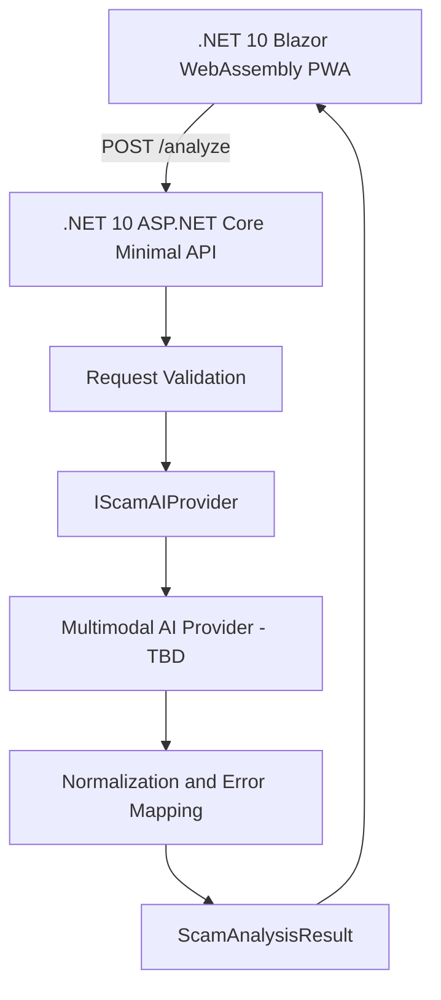

# ScamShield AI

AI-powered scam risk detection for screenshots and suspicious digital content.

> 目前已完成 Buildmode MVP 的 Web/PWA App skeleton；Backend 與實際 AI Provider 尚待實作。App 可先以 Mock mode 獨立展示完整分析流程。

## 問題與目標

使用者收到詐騙訊息時，往往不一定意識到自己需要查證。風險通常發生在點擊可疑網址、提供 OTP、匯款或交付敏感資訊之前，但現有防詐流程常需要使用者主動搜尋與比對。

ScamShield AI 的目標，是讓使用者提交可疑的截圖或圖片，由 AI 進行詐騙風險分析，提供風險、原因與建議安全行動，協助使用者在採取高風險操作前多一次低摩擦的確認。分析結果僅供風險輔助，不保證能絕對判定詐騙。

```text
Screenshot / Image
→ AI Scam Analysis
→ Risk
→ Reasons
→ Recommended Actions
```

## 核心功能

- 瀏覽器圖片選擇與 preview（JPEG／PNG）
- Responsive Web UI，可由支援的行動瀏覽器安裝為 PWA
- Multimodal AI 詐騙風險分析 API client
- Risk Score 與 Risk Level
- Scam Category
- Suspicious Signals／Reasons
- Recommended Actions
- Loading、error 與 retry flow
- Demo fallback／Mock mode

## 系統架構

目前 Architecture Freeze 採用以下最小架構：



- **Web/PWA App：**負責瀏覽器圖片選擇、preview、loading、result UI、PWA shell，以及 Remote／Mock service 切換。
- **Backend：**負責 request validation、AI provider abstraction、結果 normalization 與 error mapping。
- **AI：**負責圖片語意與詐騙風險分析；實際 Provider 尚未選定。
- **Database：**MVP 不使用 database。
- **External Services：**僅預留一個 Multimodal AI Provider，尚待選定。

MVP 不使用 queue 或 member system。瀏覽器不直接呼叫 AI Provider；API key、prompt 與 provider-specific response 均由 Backend 隔離。

## 使用技術

| 類型 | 技術／服務 | 用途 |
| --- | --- | --- |
| AI 模型 | TBD | Multimodal scam risk analysis |
| 前端 | .NET 10 Blazor WebAssembly／Razor／CSS／PWA | Responsive Web 與可安裝的行動體驗 |
| 後端 | .NET 10 ASP.NET Core Minimal API | `/analyze` API、validation、AI integration |
| Sponsor 技術 | TBD | 待確認 |

## 安裝與執行

需求：.NET 10 SDK。

啟動 Web/PWA App：

```bash
dotnet run --project src/app/ScamShield.Web/ScamShield.Web.csproj
```

終端顯示網址後，以瀏覽器開啟即可。預設 `ScamShield:AnalysisMode` 為 `Mock`，不需要 Backend 或 API key。

執行 App contract checks：

```bash
dotnet run --project src/app/ScamShield.Web.ContractChecks/ScamShield.Web.ContractChecks.csproj
```

切換 Remote mode、Backend CORS、HTTPS 與手機實機測試說明請見 [App Integration Guide](src/app/ScamShield.Web/INTEGRATION.md)。

## 作品展示

- 作品展示網址（選填）：TBD
- 評選影片：TBD

## 限制與未來工作

### Current MVP Limitations

- MVP 輸入僅限 Screenshot／Image。
- Backend 與實際 AI Provider 尚未實作，因此 Remote mode 目前無法完成真實分析。
- PWA 安裝與正式 service worker 需在 production build 並透過 HTTPS（或 localhost）提供。
- 瀏覽器版不包含 iOS／Android 原生 Share Extension、Notification Listener 或 SMS Filter。
- AI latency、rate limit 或服務中斷可能影響結果速度與 Live Demo。
- AI 分析屬風險輔助，不保證絕對判定，也不能取代使用者透過官方管道查證。
- MVP 不使用 database、queue 或 member system。

### Future Work

- iOS／Android 分享入口或原生 extension
- SMS／Notification platform integration
- URL／QR Code analysis
- Rule Engine 與 Threat Intelligence
- Domain／Phone Reputation
- Browser Extension
- Crowd Reporting
- Scam Intelligence Platform

以上皆為 Post-MVP 方向，不屬於三日 Buildmode 核心交付範圍。

## 第三方服務、資料與素材

- **AI Provider：**TBD
- **Scam test images／screenshots：**Demo 階段使用自製或經授權的測試素材
- **API credentials：**不提交至 Repository；由 Backend 使用環境變數或安全的 secret 管理方式
- **Blazor Progressive Web Application documentation：**PWA 架構與 service worker 參考；見 [Microsoft Learn](https://learn.microsoft.com/aspnet/core/blazor/progressive-web-app)
- **ASP.NET Core Minimal API documentation：**Backend 設計參考文件；見 [Microsoft Learn](https://learn.microsoft.com/aspnet/core/tutorials/min-web-api)

實際採用的第三方服務、資料來源、素材及授權方式，將在選型或素材確認後補充。

## 團隊成員

| 姓名 | 分工 |
| --- | --- |
| TBD | Engineer A — Web/PWA App / UI |
| TBD | Engineer B — AI / Backend |
| TBD | Product Marketing — Problem / Value / Pitch |
| TBD | Planning & Packaging — Demo / Presentation |

## Documentation

- [Product Plan](docs/product-plan.md)
- [Buildmode 3-Day MVP Plan](docs/buildmode-mvp-plan.md)
- [Architecture](docs/architecture.md)
- [API Contract](docs/api-contract.md)
- [App Integration Guide](src/app/ScamShield.Web/INTEGRATION.md)

## License

TBD — License 尚待團隊確認。主辦單位要求的根目錄 `LICENSE` 檔案，將在授權方案確認後加入。
